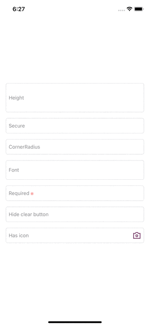

# PlaceholderTextField

[](https://cocoapods.org/pods/PlaceholderTextField)
[](https://cocoapods.org/pods/PlaceholderTextField)
[](https://cocoapods.org/pods/PlaceholderTextField)



## Example

To run the example project, clone the repo, and run `pod install` from the Example directory first.

## Requirements
- iOS 11.0 or later
- Swift 5+

## Installation

PlaceholderTextField is available through [CocoaPods](https://cocoapods.org). To install
it, simply add the following line to your Podfile:

```ruby
pod 'PlaceholderTextField'
```
## Usage

### Use case - Init with title and custom height
```swift
  let textView1 = PlaceholderTextField(placeholder: "Height").then  {
        $0.height = 80
        $0.textColor = .red
  }  
```

### Use case - Customize
```swift
  let textView = PlaceholderTextField()
  // Title
  textView.placeholder = "Placeholder title"
  // Required
  textView.isRequired = true
  // Font
  textView.font = .systemFont(ofSize: 30)
  // Boder CornerRadius
  textView.borderCornerRadius = [.layerMaxXMaxYCorner, .layerMinXMaxYCorner]
  // CornerRadius
  textView.cornerRadius = 5
  // Secure Text Entry
  textView.isSecure = true
  // Hide clear button
  textView.hasClearButton = false
  
  // Right icon
  textView.rightIcon = UIImage(named: "iconCamera")
  // Right icon action
  textView.rightButtonAction = {
      print("action")
  }
```

## Author

hosituan, hosituan.work@gmail.com - Phone: +84 983 494 681

[LinkedIn](https://www.linkedin.com/in/hosituan/) - [Medium](https://hosituan.medium.com) 

## License

PlaceholderTextField is available under the MIT license. See the LICENSE file for more info.
